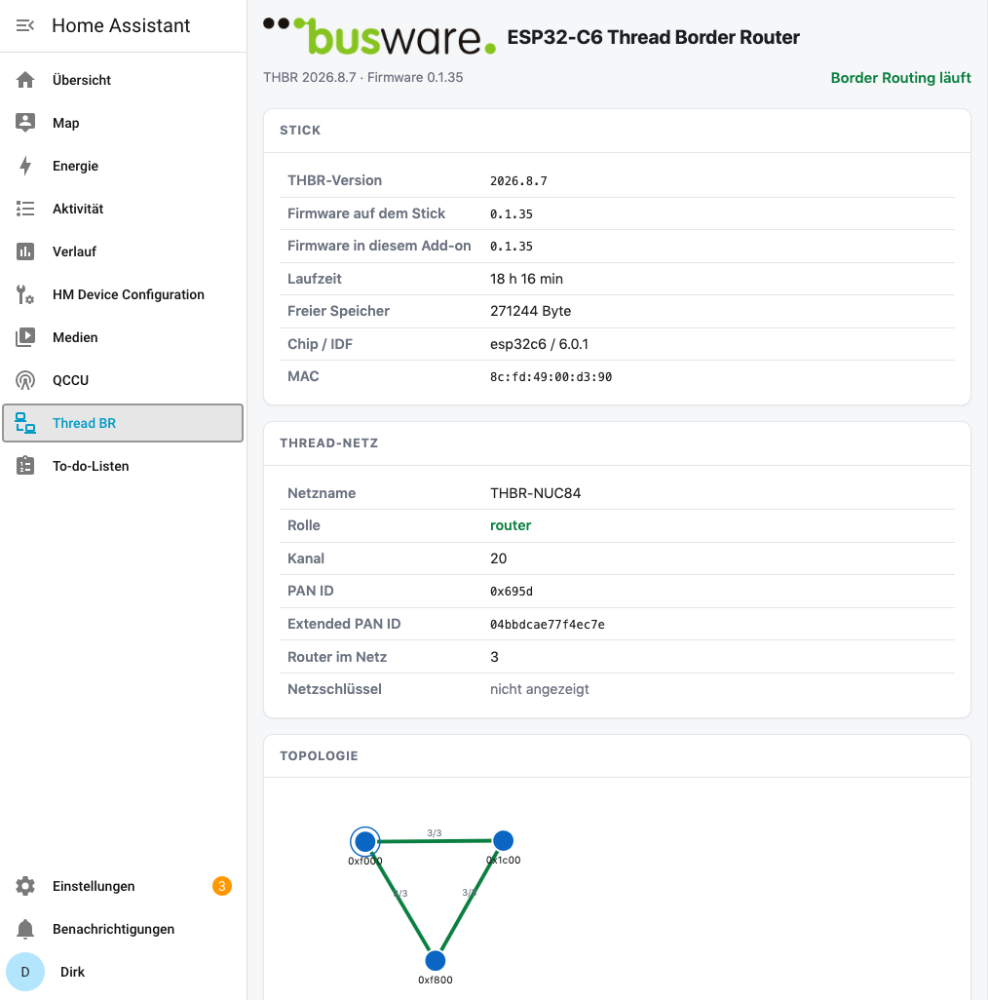
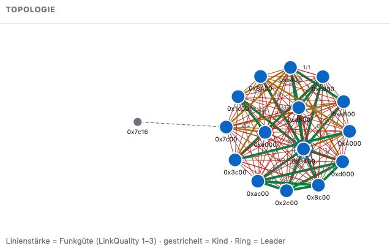

# THBR — a Thread border router on a stick

The whole border router runs on an ESP32-C6. It reaches the host through the
chip's own USB port, which the host side turns into a network interface. There
is no radio co-processor on the host, no Ethernet chip on the stick, and no
Spinel link that stops working when a host process restarts.

Because the border router lives on the stick, the Thread network survives what
happens on the host: restarting Home Assistant, updating the add-on, recreating
the container. The mesh keeps running; only the path to it pauses.

The stick also lends its Bluetooth radio to the Matter server, so a machine
with no Bluetooth of its own can still commission a Matter device.

Runs as a **Home Assistant add-on** or as a **plain Docker container** next to
Home Assistant. Both are built from the same directory.



## What it does

- **Border routing** — the stick forms or joins a Thread network, advertises a
  route to it, and the host reaches Thread devices over IPv6.
- **Matter over Thread** — Home Assistant discovers the router, imports the
  network, and commissions devices through it. Firmware updates for those
  devices flow through it too.
- **Commissioning over Bluetooth** — a Matter device is first talked to over
  Bluetooth LE, before it has ever seen the Thread network. Servers, NUCs and
  older machines often have no Bluetooth at all. The stick has, and it offers
  that radio to the Matter server: the server drives the scan, the connection
  and the exchange, and the stick carries them. Nothing to set up beyond
  switching the Matter server's own `ble_proxy` option on — the stick dials in
  and announces itself.
- **A page in the sidebar** — firmware on the stick against the one the add-on
  carries, border routing state, memory, the route into the mesh and whether
  anything answers through it, plus a graph of the mesh you can pull around.
- **Two buttons that used to need a shell** — write the bundled firmware to the
  stick over its USB port, and restart the stick.
- **Save the network settings** — the stick's Thread credentials, in a file
  Home Assistant backups carry. Restoring it onto a replacement stick moves the
  network to new hardware without re-commissioning a single device.



The graph is the fastest answer to "is the mesh healthy?": every mains-powered
device is a router and carries traffic for the rest, line weight is the link
quality between two of them, a dashed line is a child hanging off its parent,
and the ring marks the leader.

## Requirements

- An ESP32-C6 with 4 MB flash, connected by its **native USB port**
  (USB-Serial/JTAG). Firmware for the **ESP32-C5** ships alongside it and the
  add-on writes whichever matches the chip it finds — but the C6 is what the
  Bluetooth work was measured on, and the C5 carries a caveat described in
  [`addon/DOCS.md`](addon/DOCS.md). The ESP32-H2 cannot run this: Espressif
  ships no border-router library for it.
- Home Assistant OS or Supervised, or Home Assistant in Docker on a host you
  control.

## Install on Home Assistant

Home Assistant OS or Supervised. The Supervisor pulls a published image, so
this takes seconds rather than a build on your machine.

1. **Add this repository.** *Settings → Apps → App store → ⋮ → Repositories*,
   paste `https://github.com/tostmann/THBR`, **Add**. (Older versions call
   these Add-ons, as do the Supervisor's API and this project's own files.)

   The Supervisor clones the repository without credentials, so this works
   only while it is readable without logging in. From a private copy, install
   from a local one instead: put the contents of `addon/` into `/addons/thbr/`
   on the machine — over the *Samba share* or *Advanced SSH & Web Terminal*
   app, or any other route to that directory — and it appears under **Local
   apps** after *⋮ → Check for updates*. Everything below is the same either
   way.
2. **Install** *THBR Thread Border Router*, which now appears in the store
   under a heading of the same name.
3. **Choose the stick.** On its *Configuration* tab, pick the ESP32-C6
   under `device` — it is listed as *Espressif USB JTAG/serial debug unit*.
   Leave `flash` at `auto`. Save.

   With more than one USB device on the machine, make the stick identify
   itself: **plug it in last**, deliberately, right before this step. The
   add-on lists the ports it can see newest first and says how long ago each
   appeared, so the stick is the one at the top. After a reboot that ordering
   says nothing — every port is created within the same second at boot — so
   **unplug the stick and plug it back in** to make it the newest again.

   Picking the wrong one is not destructive: nothing is written to a port
   before it has been asked which chip it is and which application it carries,
   and an application this add-on did not build is never overwritten unasked.
   [Choosing the right port](addon/DOCS.md#choosing-the-right-port) has the
   detail.
4. **Start it** and watch the log. A stick that answers nothing is flashed
   first, which takes about a minute; lines prefixed `[stick]` come from the
   firmware itself. `br=running` means border routing is up.
5. **Give Home Assistant the interface.** *Settings → System → Network →
   Network adapter*: enable your normal adapter **and** `tap0`, then restart
   Home Assistant. It binds its discovery sockets per interface when it starts,
   so without `tap0` among them nothing that announces itself across the
   backbone reaches it — the router's own announcement, and the Matter devices
   behind it.
6. **Add the router.** *Settings → Devices & services → Add integration →
   Open Thread Border Router*, and give it `http://192.168.45.2` — the stick's
   address on the backbone, the `stick_addr` option if you changed it. Home
   Assistant then imports the Thread network from it, and Matter devices are
   commissioned as usual.

   It has to be typed in: Home Assistant discovers border routers over mDNS,
   and this router does announce itself there — but that discovery feeds the
   *Thread* integration, which lists routers. The *Open Thread Border Router*
   integration, the one that actually reads and writes the network, carries no
   mDNS discovery at all; it is set up automatically only for Home Assistant's
   own border-router add-on.

The add-on then has its own page in the sidebar, **Thread BR**: state of stick
and network, a graph of the mesh you can pull around, and the buttons for
firmware, restart and network settings. What each option does, and what to do
when a step above does not produce what it says, is in
[`addon/DOCS.md`](addon/DOCS.md).

## Install with Docker

For Home Assistant in a container of your own. The image is on Docker Hub as
[`tostmann/thbr`](https://hub.docker.com/r/tostmann/thbr), multi-arch for
`arm64` and `amd64`:

```
docker pull tostmann/thbr
```

Take the `thbr` service from [`addon/compose.yaml`](addon/compose.yaml), point
`THBR_DEVICE` at your stick's `/dev/serial/by-id/…` path, and start it. Then do
step 5 and 6 above — they are the same for both ways of running it.
[`addon/README.md`](addon/README.md) has the details, including what the
container needs from the host and why.

## Matter without Home Assistant

The border router carries IPv6 into the Thread mesh; Matter itself is spoken by
a Matter server, and that server runs perfectly well without Home Assistant.
Two things are worth knowing before choosing one.

**Which server.** Commissioning over the stick's Bluetooth radio needs a server
that accepts a proxy radio. `ghcr.io/matter-js/matterjs-server:stable` does,
started with `--ble-proxy`. `ghcr.io/home-assistant-libs/python-matter-server`
does not — its greeting reports no proxy support, and the stick's offer is
turned away. If the add-on finds a server on the address the stick dials, it
says which of the two it is rather than leaving you to guess.

**Where it listens.** The stick dials `192.168.45.1:5580`, the host end of its
own backbone. A server published on every interface already covers that, and
the stick reaches it directly. Only when the server is reachable on loopback
alone — which is what Home Assistant does — does the add-on forward.

Pairing then happens in the server's own web page on that port: it takes the
pairing code and drives the commissioning, and the Bluetooth for it comes from
the stick.

For **FHEM**, [`fhem/README.md`](fhem/README.md) walks the whole way from a
factory-new IKEA device to the point where FHEM takes over: the stick, the
Matter server, the Thread credentials it needs, and the pairing itself. The
FHEM side beyond that — devices, readings, switches — is
[fhem-matter](https://gitlab.com/zeppelin1979/fhem-matter), which talks to the
same server.

## How it fits together

```
Home Assistant ─ Matter server ─┐
                                │  tap0   (an interface on the host)
                          add-on / container
                                │  SLIP over CDC-ACM
                            ESP32-C6      (border router, on the chip)
                             │         │
                    802.15.4 │         │ Bluetooth LE
                             │         │
                  Thread devices       a device being commissioned
```

The backbone between host and stick is a private point-to-point link
(`192.168.45.0/24` by default) and does not touch your LAN. The stick answers
there with an ot-br-posix-compatible REST API and reports its own state on a
second port.

The Bluetooth path runs over the same backbone. The Matter server offers a
websocket endpoint for a proxy radio, and the stick dials it: the server sends
scan and connect commands, the stick answers with what its radio finds, and the
commissioning exchange crosses in binary frames. On Home Assistant the Matter
server publishes its port on the loopback interface only, which the stick — a
hop away on the tap — cannot reach, so the add-on listens on the host end of
the backbone and forwards. `THBR_MATTER_ADDR` says where to forward to and
switches the whole thing off when empty.

## Building it yourself

```
THBR_STAGE=2 THBR_VARIANT=ble scripts/build.sh                  # C6 firmware, the one that ships
THBR_BUILD_DIR=/root/thbr_idf_build_ble scripts/dist.sh          # file it under addon/firmware/esp32c6/
THBR_STAGE=2 THBR_VARIANT=c5 THBR_NO_BUMP=1 scripts/build.sh    # C5, same firmware version
THBR_BUILD_DIR=/root/thbr_idf_build_c5 scripts/dist.sh
docker build -t thbr addon/                                     # the container image
```

`sdkconfig.defaults` is layered: `.br` turns the border router on, `.ble` adds
the Bluetooth proxy, `.c5` retargets the same sources at an ESP32-C5. The
variant is not optional: without `THBR_VARIANT=ble` the build succeeds, comes
out a third smaller and carries no Bluetooth stack at all, and nothing but the
file size says so. Build once per chip; `THBR_NO_BUMP=1` keeps the second chip
on the first one's version number, and `scripts/dist.sh` files each build
under its own chip, so the add-on picks the one matching the stick in front of
it. `THBR_VARIANT=heap` is the C6 build plus a heap census endpoint
(`sdkconfig.defaults.heap`) — an investigation build, never shipped.

Publishing a release builds both architectures natively and pushes them under
the version in `addon/config.yaml`:

```
THBR_REMOTE_HOST=user@other-arch-host scripts/publish_images.sh
```

`scripts/idf_env.sh` sets up the toolchain and is host-specific; it is not part
of the repository.

## Licence

**PolyForm Noncommercial License 1.0.0** — free for anything that is not
commercial. See [LICENSE](LICENSE).

The components this builds on keep their own licences, which these terms do not
narrow: OpenThread under BSD-3-Clause, the Espressif components under
Apache-2.0, cJSON under MIT, and esptool — shipped unmodified and run as a
separate program — under GPL-2.0-or-later. [NOTICE](NOTICE) lists them.
